# Welcome to UGST!

Hello, **Free Security Certification Community** will soon serve the whole world. Currently only it serves to **Turkey**. So what is **UGST**?
- **UGST** is a community that offers you a free code signing certificate.
Soon it will be everywhere...
Thank you for your attention...

# UGST ye Hoş Geldiniz.

**UGST** yani (**Ücretsiz Güvenlik Sertifikası Topluluğu**)
UGST Sadece Türkiye'de geçerli bir sistemdir. Amacımız, Sizlere satın alması çok pahalı olan kod imzalama sertifikalarını ücretsiz sağlamaktır...

## Kod İmzalama Sertifikası Olmadan İşlemler Nasıl Olur!

Örnek vermek gerekirse: Windows işletim sistemlerinde Program çıktısı(Executable) dosyalara sağ tıklayıp **Yönetici Olarak Çalıştır** dediğimizde bize programın güvenli olmadığını söyler ve yayımcının adını göstermez.

## Kod İmzalama Sertifikası Olunca İşlemler Nasıl Olur!

Örnek vermek gerekirse: Windows işletim sistemlerinde Program çıktısı(Executable) dosyalara sağ tıklayıp **Yönetici Olarak Çalıştır** dediğimizde bize programın güvenli olduğunu söyler ve yayımcının adını gösterir.

## Nasıl Ücretsiz Sertifika Alabilirim?

1. İlk önce [UGST Root CA](https://korayustundag.github.io/UGST/CertificateAuthority/cacert.zip) sertifikasını indirip bilgisayarınızın güvenilir kök sertifika yetkililerinin içine yüklemeniz gerekmektedir.
>**NOT:** Bu işlemi yapmazsanız almış olduğunuz ücretsiz sertifikalar, güvenik uyarısı verir.
2. [Buraya Tıklayarak](https://decoder.link/csr_generator) CSR kodu oluşturunuz. Oluşturduğunuz CSR kodunun yanında size birde Private Key yani Özel Anahtar verilecektir. 
>**NOT:** Size verilen **Private Key** yani özel anahtarınızı saklayınız! Yoksa Sertifikayı kullanamazsınız!
3. CSR Kodunu [ugsttrustservices@gmail.com](mailto:ugsttrustservices@gmail.com) mail adresine mail gönderiniz.

Gönderme işlemi tamamlandıktan sonra sertifikanız yoğunluğa göre 1-5 Gün arasında bize gönderdiğiniz mail adresine gönderilir.
Sabrınız için teşekkür ederiz :)

## Programımı Nasıl İmzalayabilirim?

1. [DigiCert Certificate Utility](https://www.digicert.com/util/) Programını indirin ve Programı Açın.
2. Sol Menüden **Code Signing** bölümünü seçin.
3. Sağ üst menü seçeneklerinden **Import**'a tıklayın.
4. Browse'a tıklayıp uzantısı .**pfx** olan sertifikanızı seçiniz ve ileri deyiniz.
5. **Sertifika şifrenizi** yazınız ve işlemleri tamamlayınız.
6. İçeri aktardığınız sertifikayı seçiniz.
7. Sağ alt bölümden **Sign Files**'i seçiniz.
8. Açılan pencerede **Add Files**'e tıklayınız.
9. Açılan pencerede imzalamak istediğiniz **uygulamayı** veya **uygulamaları** seçiniz.
10. Sonra **Sign** bölümüne tıklayınız.
11. Son olarak Uygulama imzalandı diye bir mesaj çıktıktan sonra tamama basınız.

Bütün işlemler tamamlandıktan sonra artık, uygulamanız sertifika ile imzalanmış olacaktır.

## .crt Dosyasını Nasıl .pfx Dosyasına Dönüştürebilirim?

1. [Buraya tıklayarak](https://www.sslshopper.com/ssl-converter.html) dönüştürme işleminin yapılacağı siteye gidiniz.
2. Certificate File to Convert bölümünde bulunan **Dosya Seç**'e tıklayınız, ardından size gönderdiğimiz .**crt** uzantılı sertifikanızı seçiniz.
3. Type of Current Certificate bölümündeki alanın **Standard PEM** olmasına dikkat edin.
4. Type To Convert To bölümünden **PFX/PKCS#12**'yi seçin.
5. Private Key File bölümünden **Dosya Seç**'e tıklayıp **Private Key** yani özel anahtarınızı seçiyorsunuz.
>**NOT:** Private Key yani özel anahtarınız, CSR oluştururken size verilen anahtardır.
6. PFX Password bölümüne istediğiniz bir şifreyi belirliyorsunuz.
>**NOT:** Bu şifreyi unutmayın, çünkü program imzalarken size bu şifre sorulacak.
7. Sağ alt bölümden **Convert Certificate**'ye tıklayın. Zaten .**pfx** uzantılı dosya otomatik olarak iniyor.

## Ücretsiz Güvenlik Sertifikası Topluluğu
* [Koray ÜSTÜNDAĞ](mailto:mskorayustundag@gmail.com) Yönetici ve Kurucu
* [Eylül DOĞAN](mailto:mseyluldogan@gmail.com) Üye
* [Berant GÜL](mailto:berantgl@gmail.com) Üye
* [Melis DİYAR](mailto:msmelisdiyar@gmail.com) Üye
* [Büşra SAM](mailto:msbusrasam@gmail.com) Üye
* [Derya ÇİÇEK](mailto:msderyacicek@gmail.com) Üye
* [Zeynep DOĞAN](mailto:zeynepdogan@yandex.com.tr) Üye

### Aramıza katılmak ister misiniz?
Güvenlik Sertifikalarından anlamanız yeterlidir.
[Buraya Tıklayarak](https://yakında/) aramıza katılabilirsin...
